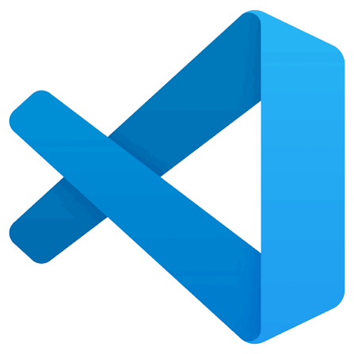
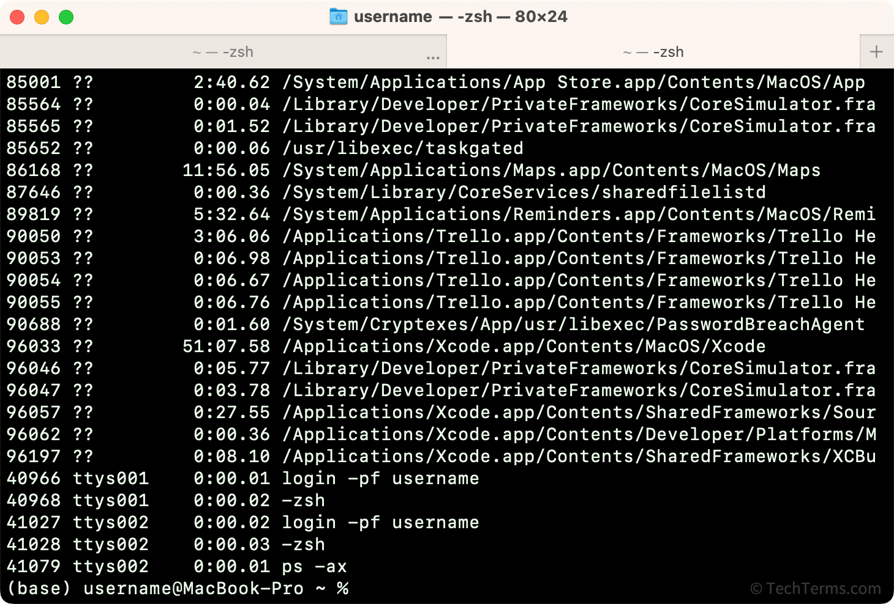
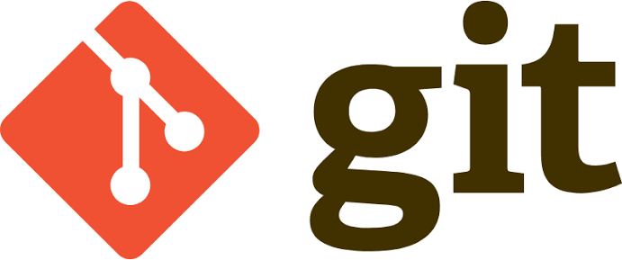
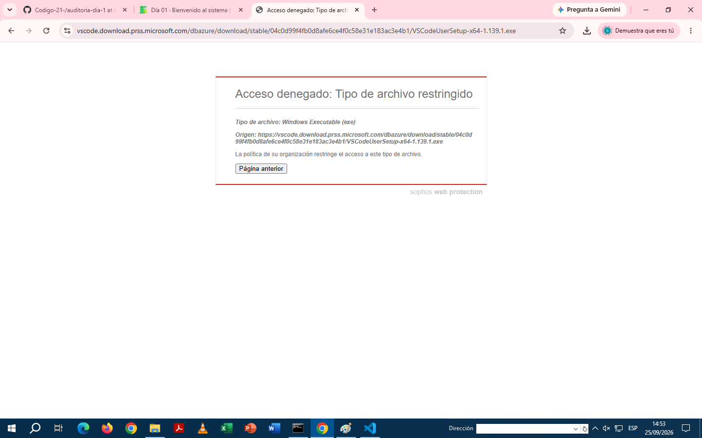

# DEFINICION DE LOS TERMINOS DEL DIA 1
laboratorio de dulce rixtun 
# temas a tratar 
1. VS code
2. terminal
3. git
4. github
5. repositorio 
# VS CODE (Visual Studio Code )
es un un programa que sirve para escribir y editar codigo se puede usar para crear paginas web,aplicaciones y otros proyectos.Tiene herramaientas que ayudan a escribir un codigo de manera mas facil y ordenada 

# TERMINAL 
es una herramienta para hacer comandos para darle instrucciones a la computadora y realizar diferentes tareas. como ejecutar programas o trabajar con archivos 

# GIT
es una herramienta para guardar los cambios de un poryecto y llevar un control de sus diferencias versiones 

# GITHUB
Es una plataforma donde podemos guardar, compartir y trabajar un proyectos de programacion,especialmente usando Git 

# REPOSITORIO
Es un lugar donde se guardan los archivos los codigos  de un proyecto junto a los cambios que se van haciendo tambien permite llevar un registro de los cambios y poder revisar las versiones anteriores y trabaja en el proyecto de forma mas ordenada y facil.

# VERSIONES INSTALADAS 
vs code su version es la "instalador de usuario.x64
y la de Git hay variedad pero la que instalamos fue la que estaba con este codigo 
winget install --id Git.Git -e --source winget
pero su version es ( 2.55.0(5) ) x64 de Git para Windows que fue lanzada hacer 36 dias aproximandamente y hay muchas mas descargas independientes.
 # DIAGRAMA
 
 # CAPTUTAS 
 
 # UN PROBLEMA ENCONTRADO 
 El problema encontrado fue que al principio es que no me dejaba instalar las aplicaciones pero pedi ayuda y me ayudaron, tambien el problema esque estba en ingles todo,ingles del todo no lo se pero despues lo pase todo a español y se me resulto mas facil.
 
 